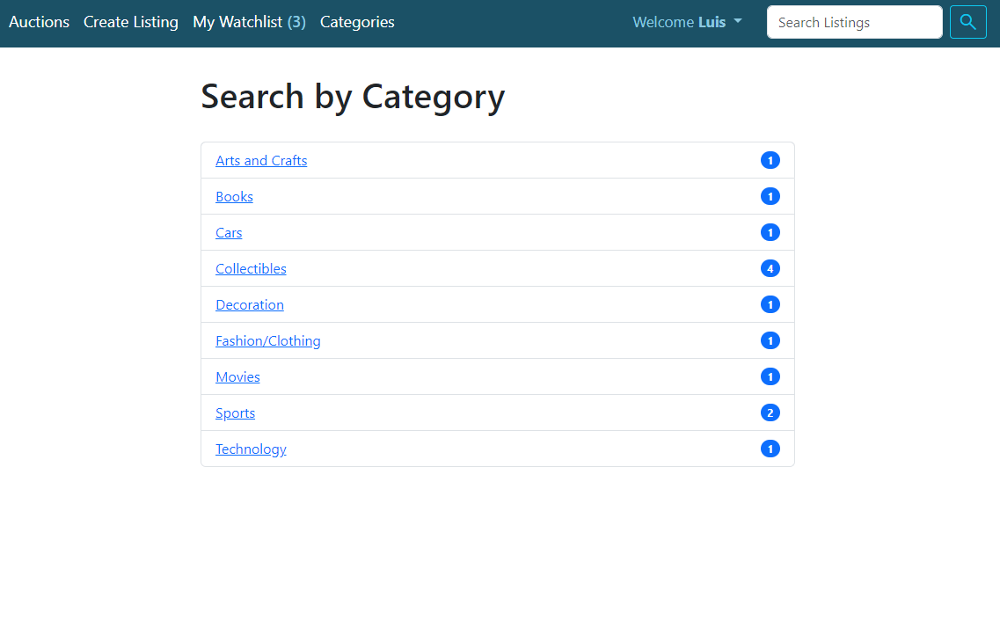
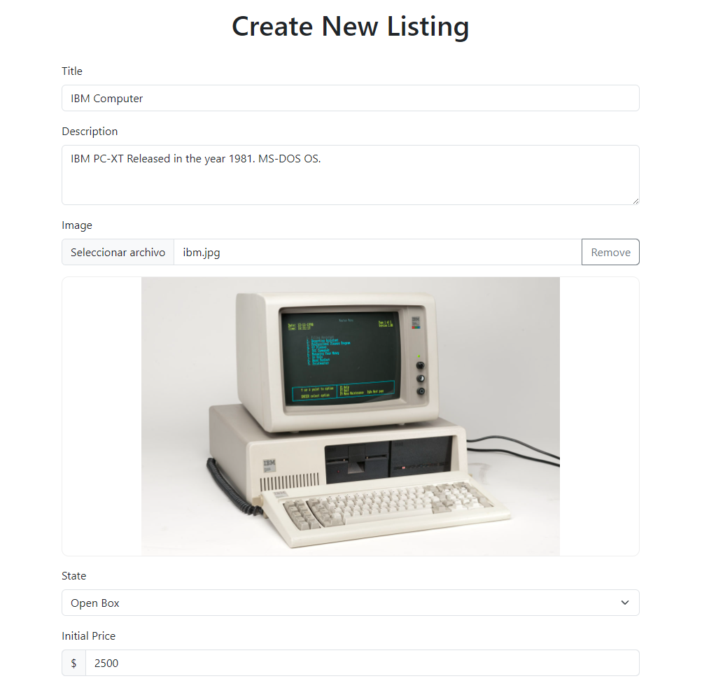
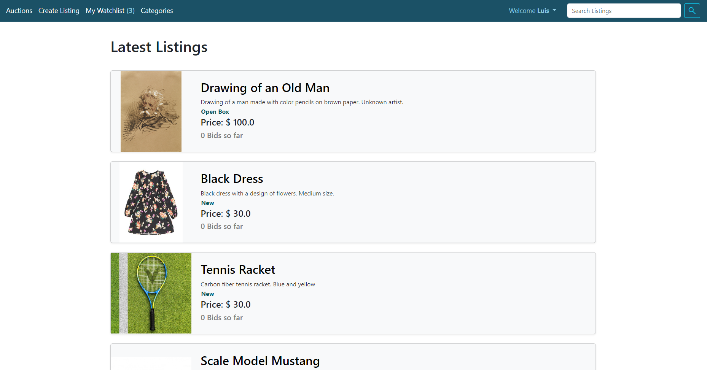
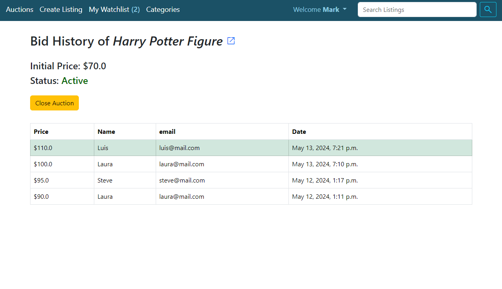
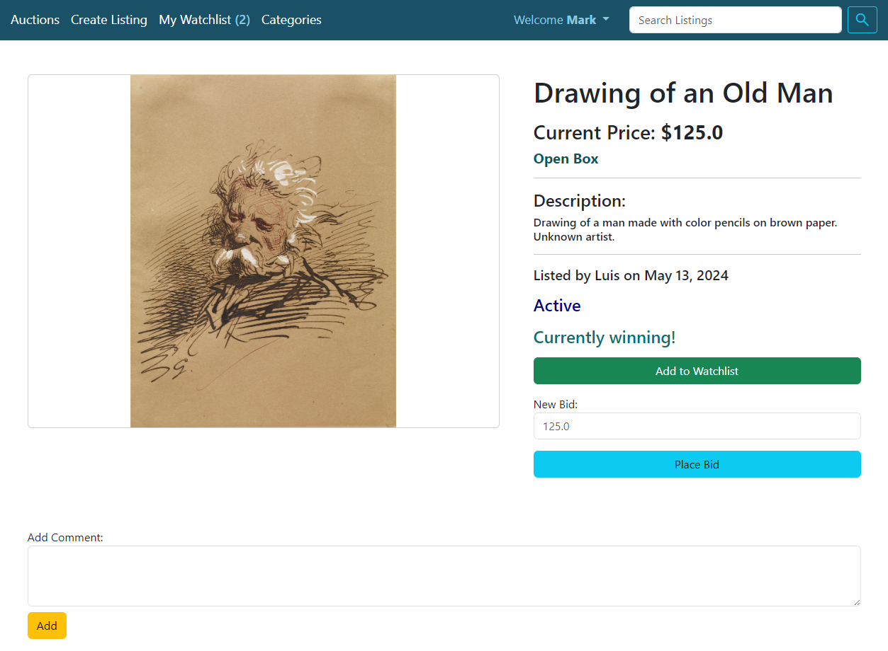
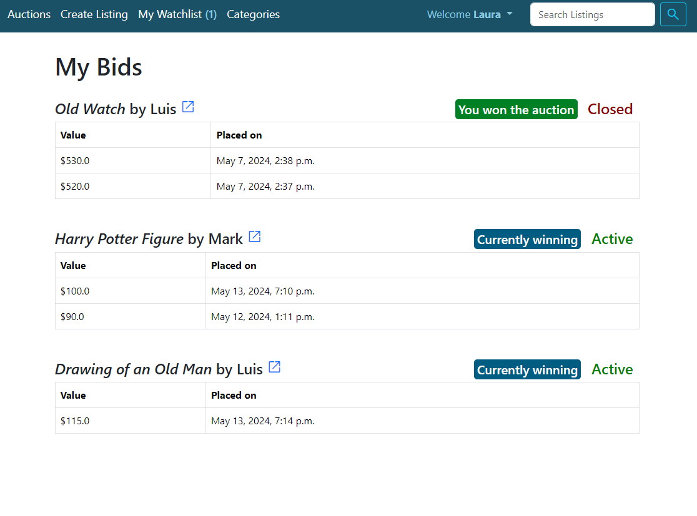
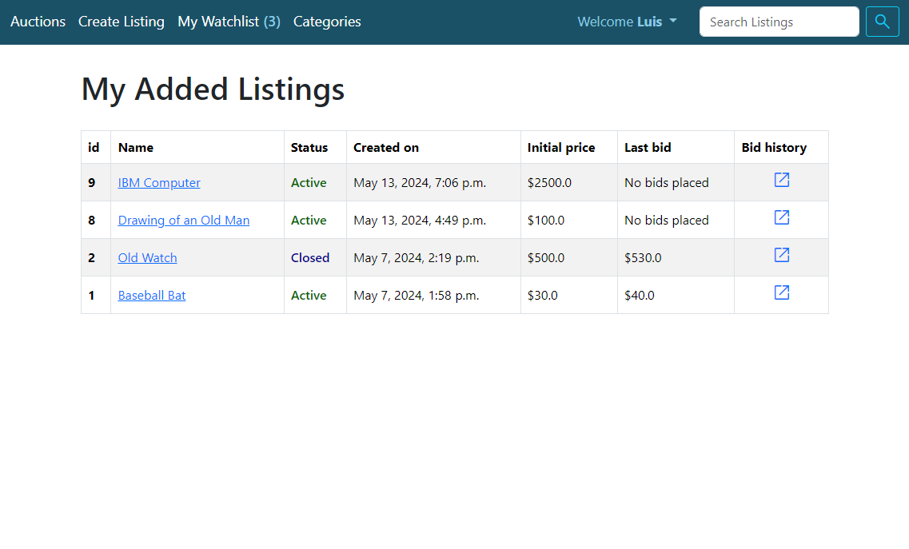
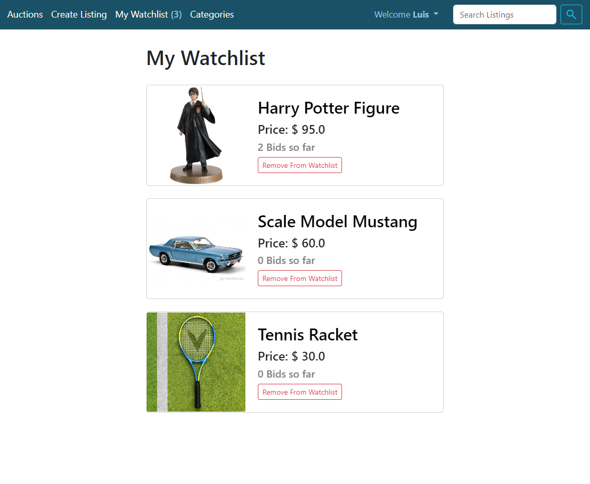
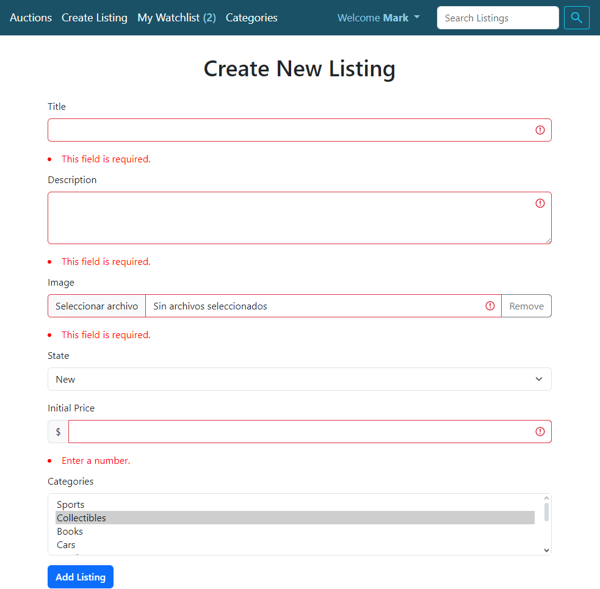

# AUCTIONS WEBSITE PROTOTYPE

## Description

Auctions website built using Django for the backend and HTML, CSS, JavaScript and Bootstrap for the frontend.

Features:

- Listing creation
- Search by category or by using a searchbar
- Place bids on listed items
- The ability to win or lose an auction
- Open and close auctions
- User history of bids placed on listings
- Listing history of all bids placed by users
- User watchlists
- User authentication
- Form validation in the frontend and the backend with feedback
- Add comments to listed items

## Getting started

This project was developed using django 5.0.6

Before running the program, consider the following:

In "commerce/urls.py" the second path, which allows to access all the application routes, is commented out to avoid errors in the initial migrations. To uncomment the path, we must first make the initial migrations with:

`python manage.py makemigrations`

`python manage.py migrate`

After that we must populate the "Categories" and "States" tables from the database. For this we run the following commands:

`python manage.py loaddata categories.json`

`python manage.py loaddata states.json`

"auctions/fixtures/categories.json" and "auctions/fixtures/states.json" contain category names and states for items usually offered at auction or e-commerce sites. Modify these files for your own specific requirements.

Having run the previous commands we now can uncomment the second path at "commerce/urls.py" and run the server with:

`python manage.py runserver`

Now you are able to create and log in to your own accounts, create listings, search for other users' listings by using a searchbar or searching by category, place bids on the items, close and open auctions, win or lose auctions, add items to to your personal watchlist, access the histories of your own bids and the bids placed on the listings added by you.

## "commerce" directory

This is the directory that has all the main files necessary for the initialization of the application.

## "media" directory

### Contains all the images uploaded by the user when creating a listing

## "auctions" directory

### This directory contains all the files necessary for the functioning of the auctions application

- **admin.py**: Contains all the  database models that can be accessed and modified as a super user by using the admin interface.
- **apps.py**: It has the configuration of the app.
- **forms.py**: Contains all the forms used in the application
  - NewListingForm: Form that allows user to add a new listing with a title, description, image, state, initial price and related categories.
  - BidForm: Allows any user other than the creator of the listing, to place a bid with a bigger value than the initial price or the last bid placed.
  - CommentForm: Allows a logged user to add a comment to a listing.
  - UserForm: Used for registering a new user with a required username, password and email. A password confirmation field is added for security.
- **middleware.py**: Used to manually add a timezone

- **models.py**: Creates the models used to store all the app's information
  - User: Creates the table that stores all the users information when registered. The required fields are username, email and password.
  - State: Table that stores the names of the states of the items (Initialized with "fixtures/states.json").
  - AuctionListing: Table that stores all the listings added by users. The fields are: title, description, image location, state (as foreign key), user that created it (FK), initial price, status (boolean active or closed), creation date and last update date. It also creates a many to many table in relation to users for the watchlist functionality.
  - Bid: Creates table to store all the bids placed by users on listings. Its fields are: the value of the bid, the user that placed it (FK), the listing it has been placed on (FK) and the date on which it was placed.
  - Comment: Creates table of all the comments with the fields of the comment itself, the listing (FK), creation date and user that posted it (FK).
  - Category: Creates a table that contains names of categories (Initialized with "fixtures/categories.json") and a many to many table in relation to listings.

- **urls.py**: Includes all the urls used by the auctions application linked to their specific views.
- **views.py**: Contains all the main functionality of the application such as the database interactions and the rendering of the html pages with context.

- **Fixtures directory**: Contains "categories.json" and "states.json". Both files are used to populate the categories and states tables in the database.

- **Migrations directory**: It has the history of changes made to the models in the database.
- **Static directory**: Contains the CSS file for styling the pages and the files that allow to make ajax requests and dynamic changes to the pages.

  - listingPage.js: Adds the functions to dynamically place bids, add comments, add or remove items from the watchlist and close or open auctions through ajax requests.
  - imgPreview.js: Allows user to preview the image and remove it when creating a listing in the browser.
  - listingBids.js: Allows user to close or open an auction from the listing bids page.
  - utils.js: Contains the function used to get a specific cookie from the user's session.
  - validation.js: Used in the register, login and create_listing html pages to add a red indicator when invalid information has been uploaded to the server and it has been rejected.
  - watchlist.js: Allows user to remove an item from their watchlist and start a vanishing animation of the item.
  - styles.css: Contains the styles and media queries for elements in all the html templates.

- **Templates directory**: Contains all the html templates used for the different functionalities of the application

## Website HTML Pages

### categories.html

#### Page that displays the categories for which there are listings in the database. There is a link for each category as well as the number of items that belong to them

  

### create_listing.html

#### Page that displays the form used to add a new listing by a registered user

  

### index.html

#### Page that shows all the active listings ordered by date starting with the most recent one. For each listing it is shown the image, title, state, description and number of bids placed

### layout.html

#### It contains the head of all the other templates and the navbar that lets the user navigate through the pages

- The head contains the stylesheet link, the cdn to load bootstrap library and the cdn for the google material ui library.
- The navbar changes according to the session state of the user and contains links to go to the index page, create a new listing, go to the user's watchlist, go to the categories page, see all the listings added by the user as well as the bids placed by them. At the top-right of the page there is a searchbar to search for specific listing names.

### listing_bids.html

#### Page that displays a table with all the bids that have been placed on a listing. This page can only be accessed by the creator of the listing and there is a button to close or open the auction

### listing_page

#### Page that shows all the information of a listing such the image in full size, title, description, state, date of creation, status (Active or closed) and current price. Depending on the user and the state of their session, there can be options to add or remove the item from the watchlist, place a new bid, close or open the auction or add a new comment. Messages may also appear when the user is currently winning an auction or has won

### login.html

#### Page that displays the form for a use to log in with their username and password

### register.html

#### Page that shows the form for a new user to create a new account with the fields of username, email, password and password confirmation

### user_bids.html

#### Page that shows a table for each item the user has placed bids on and see if they are currently winning or have won the auction

### user_listings.html

#### Page that displays a table that contains all the listings placed by the user

### watchlist.html

#### Page that shows all the listings added to the watchlist by the user. Each listing has basic information and a button to remove it from the watchlist

### Form Validation

#### All forms are validated on the client and server side with the help of django's built in validation and cleaning methods

## Database

### All the data is stored inside a sqlite3 database and is manipulated using Django's ORM
